## 《XXL-JOB二开修改记录》
### 1.1 数据库
#### 1.1.1 调度信息表添加任务主题
```
    ALTER TABLE `xxl_job_info` ADD COLUMN `job_topic` VARCHAR(10) COMMENT '任务主题' AFTER `job_desc`;
```
### 1.2 页面
- jobinfo.index.ftl<br>
<br>
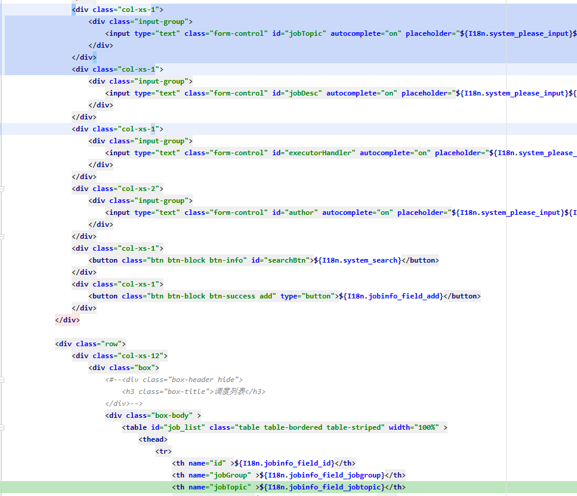<br>
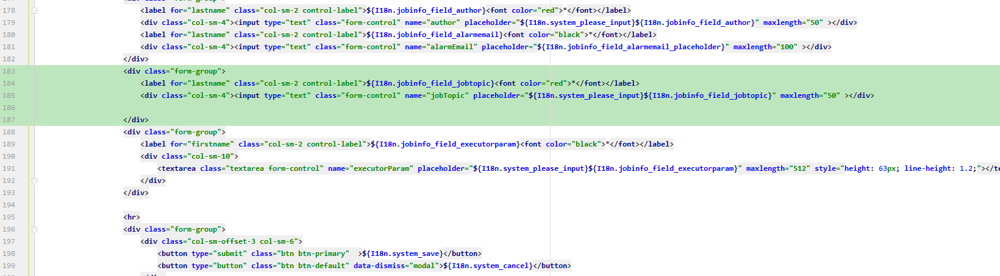<br>
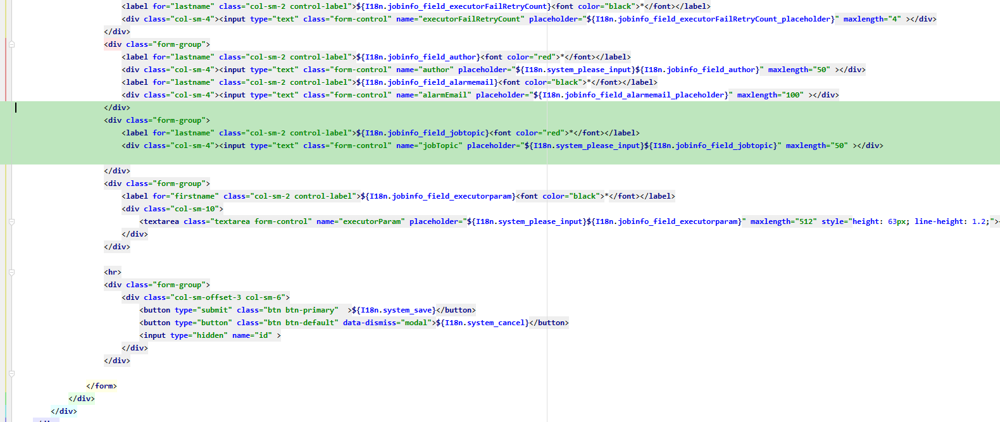<br>
- joblog.index.ftl<br>
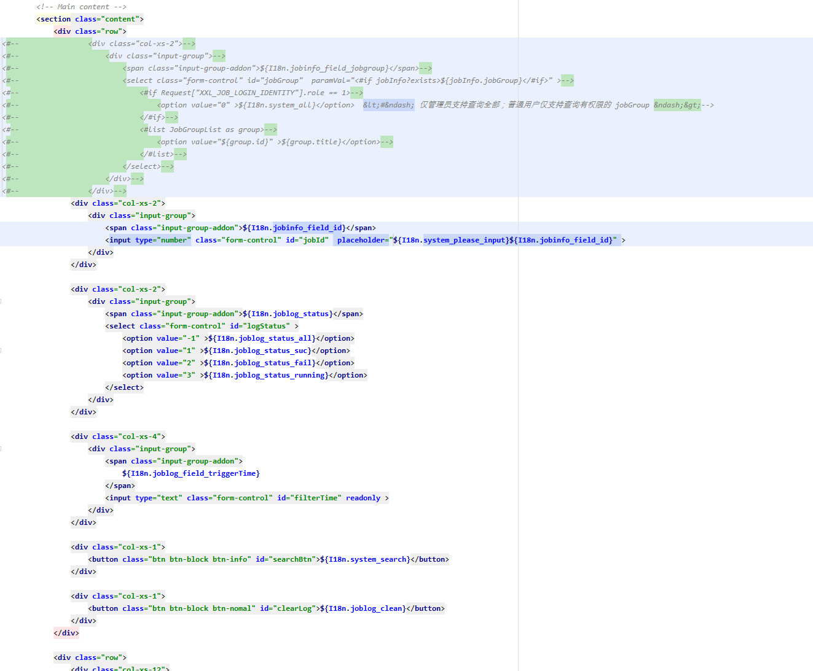<br>
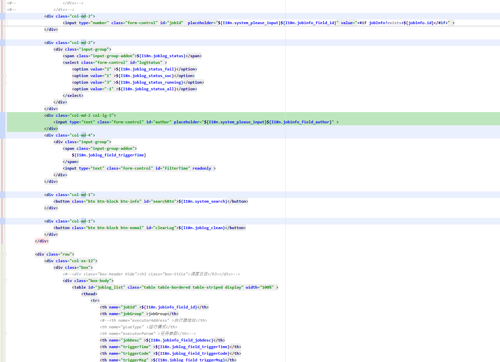<br>
### 1.3 JS
- jobinfo.index.1.js<br>
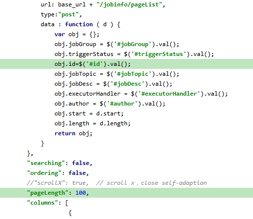<br>
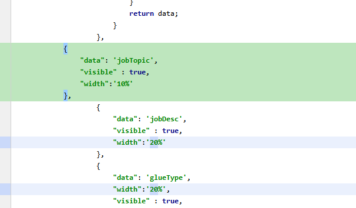<br>
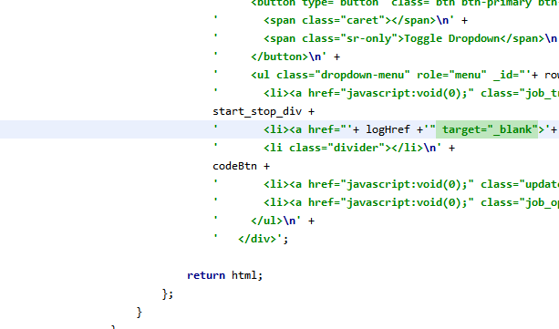<br>
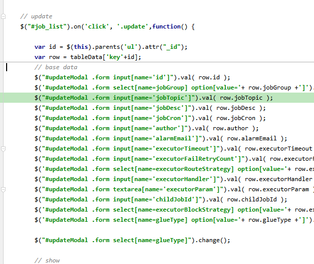<br>
-  joblog.index.1.js<br>
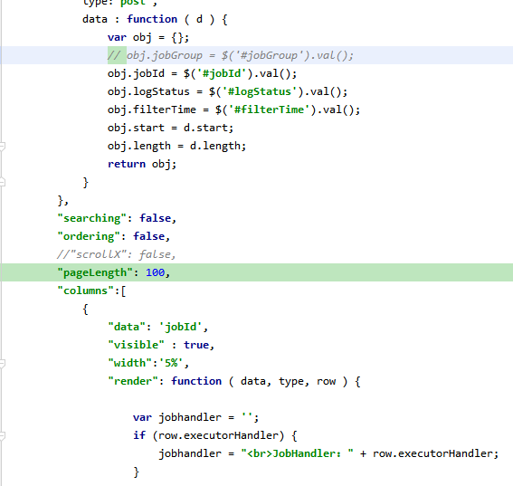<br>
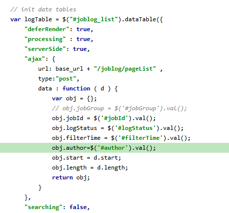<br>
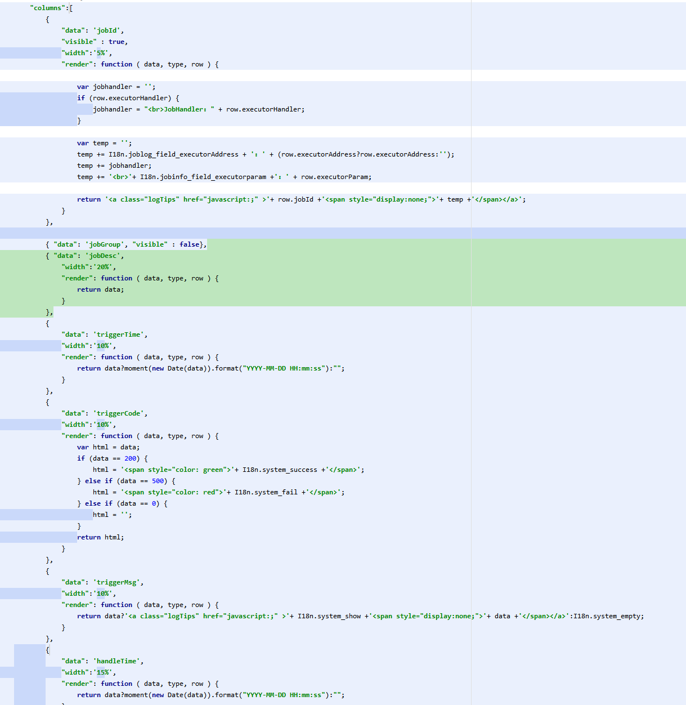<br>
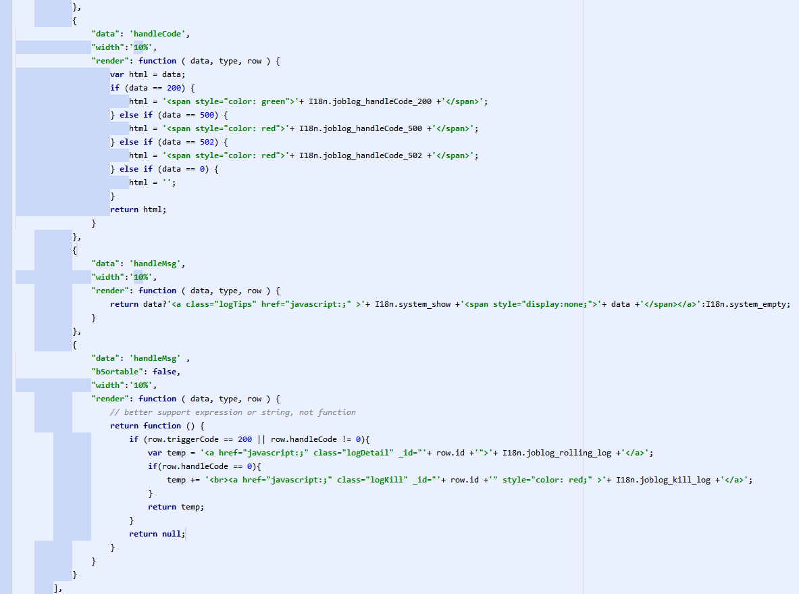<br>
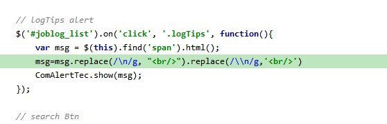<br>