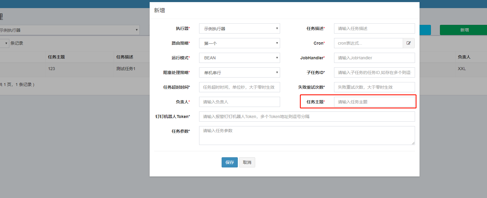
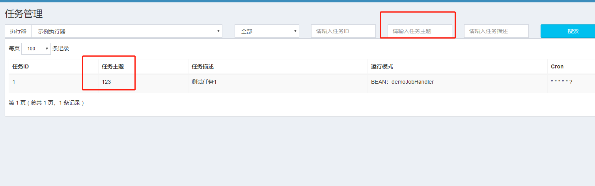
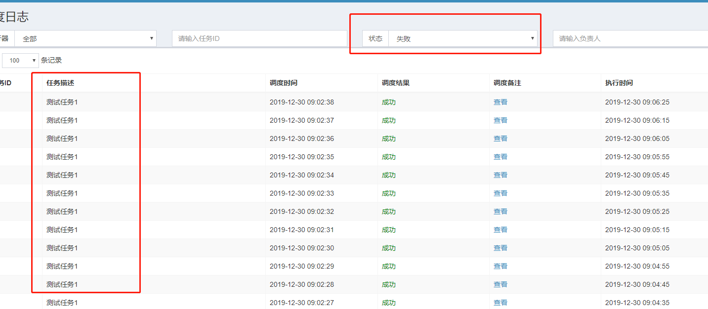
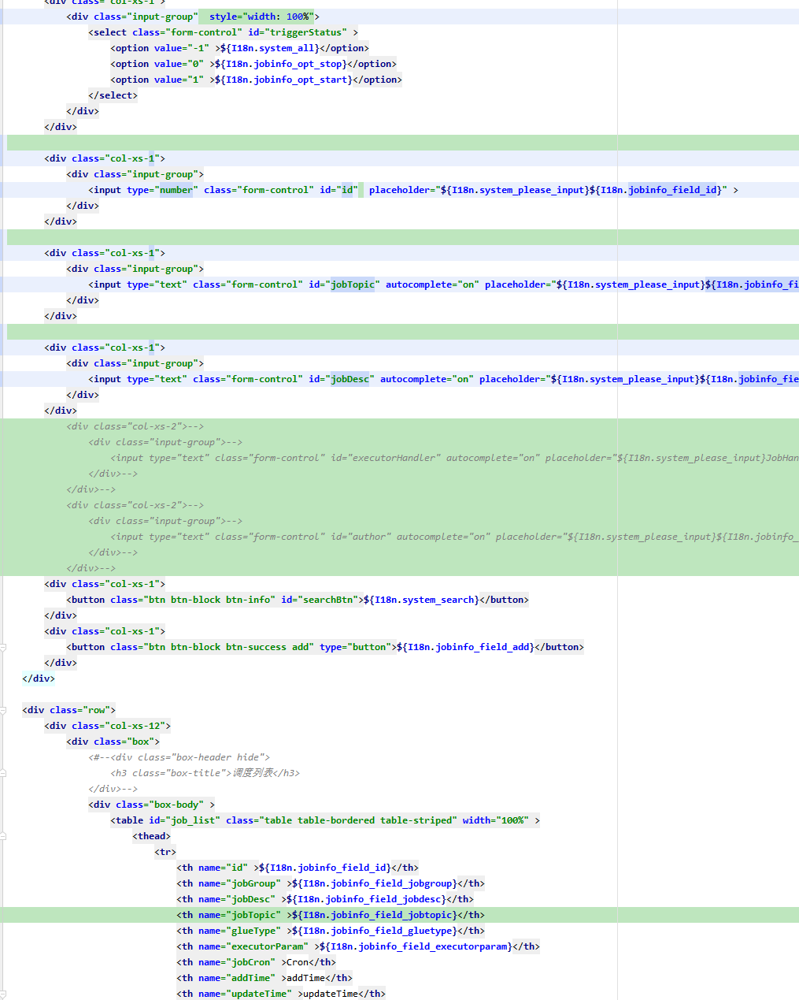
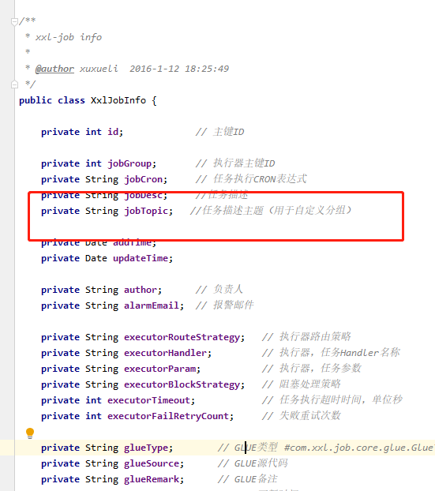
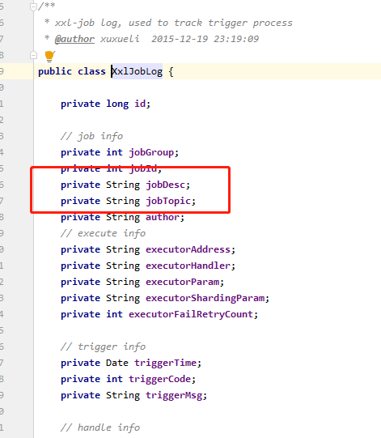
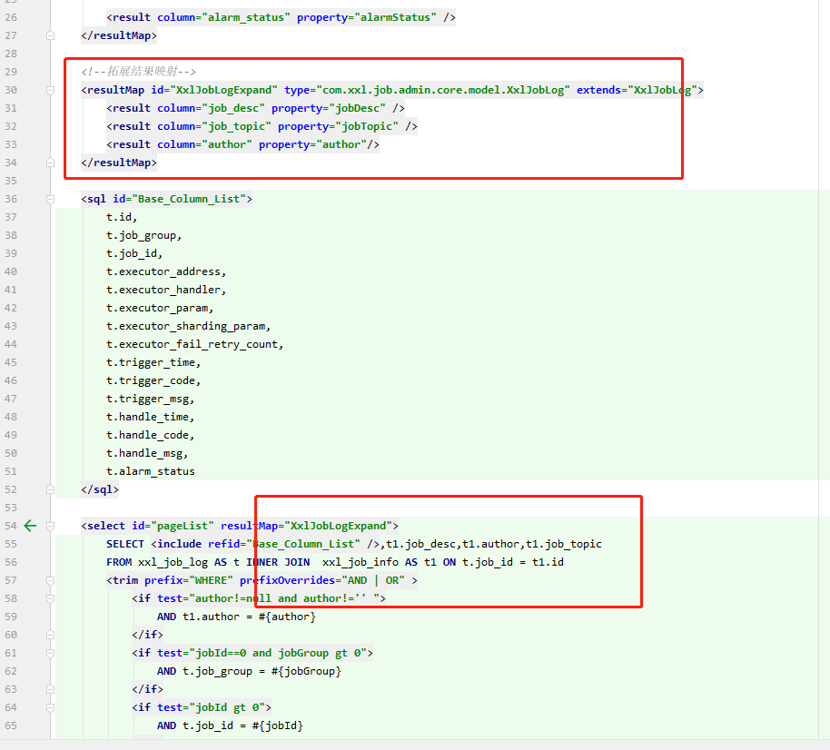
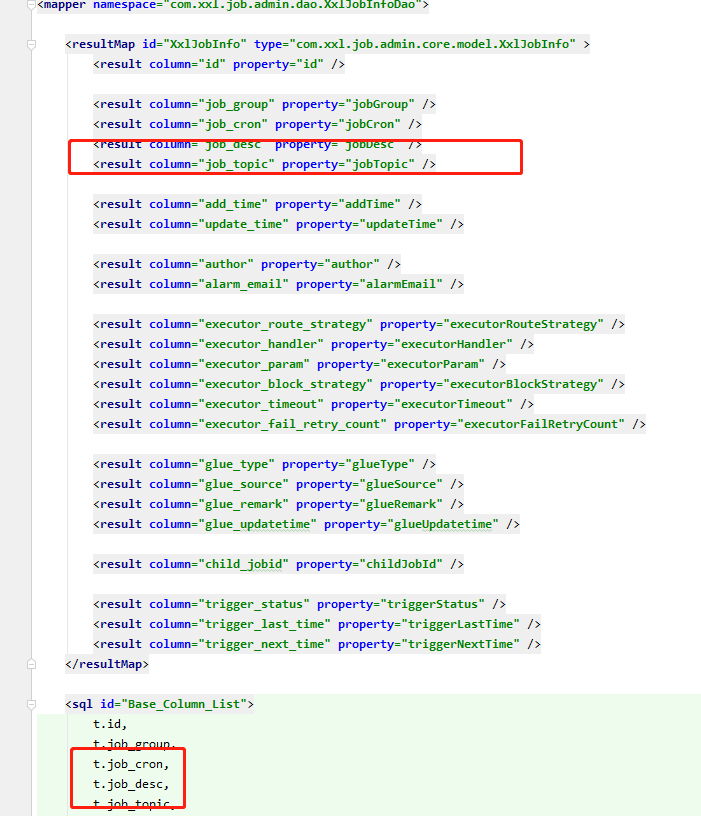

## 《XXL-JOB二开修改记录》
### 1.1 数据库
#### 1.1.1 调度信息表添加任务主题
```
    ALTER TABLE `xxl_job_info` ADD COLUMN `job_topic` VARCHAR(10) COMMENT '任务主题' AFTER `job_desc`;
```
### 1.2 功能修改
- 任务管理添加topic主题字段
<br>
<br>
- 调度日志默认显示失败状态 
- 调度日志显示任务描述
- 调度日志执行日志查看打开新页面
<br>
### 1.3 代码截图
* 不多做记录了就是对应的controller model service dao freemarke 进行修改
- jobinfo.index.ftl<br>
<br>
<br>
<br>
<br>
- joblog.index.ftl<br>
<br>
<br>
- jobinfo.index.1.js<br>
<br>
<br>
<br>
<br>
- joblog.index.1.js<br>
<br>
<br>
<br>
<br>
<br>
- jobinfo.java<br>
<br>
- joblog.java<br>
<br>
- mybatis <br>
<br>
<br>


