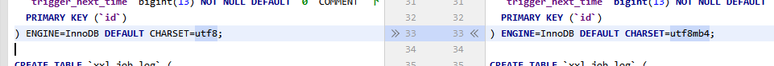
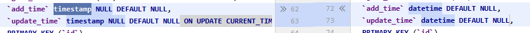

## 《二次开发修改记录》
### 1.1 数据库
#### 1.1.1 调度信息表添加任务主题
```
    ALTER TABLE `xxl_job_info` ADD COLUMN `job_topic` VARCHAR(10) COMMENT '任务主题' AFTER `job_desc`;
```
#### 1.1.2 官方2.1.2版本数据库编码集进行了修改 

- utf8 -> utf8mb4
#### 1.1.3 官方2.1.2版本数据库时间格式进行了修改

- datetime -> timestamp
```
    `add_time` timestamp NULL DEFAULT CURRENT_TIMESTAMP,
    `update_time` timestamp NULL DEFAULT NULL ON UPDATE CURRENT_TIMESTAMP
```
#### 1.1.4 官方2.1.2版本添加了执行器注册表索引
```
   xxl_job_registry
      KEY `i_u` (`update_time`)
```
#### 1.1.5 官方2.1.2版本字段进行了修改
- varchar(50) -> varchar(255)
```
   xxl_job_registry
     `registry_group` varchar(255) NOT NULL,
```
- int(11) ->  tinyint(4) 
```
   xxl_job_group
    `order` tinyint(4) NOT NULL DEFAULT '0' COMMENT '排序',
```
#### 1.1.6 官方2.1.2版本加入了调度日志报表
```
   CREATE TABLE `xxl_job_log_report` (
     `id` int(11) NOT NULL AUTO_INCREMENT,
     `trigger_day` datetime DEFAULT NULL COMMENT '调度-时间',
     `running_count` int(11) NOT NULL DEFAULT '0' COMMENT '运行中-日志数量',
     `suc_count` int(11) NOT NULL DEFAULT '0' COMMENT '执行成功-日志数量',
     `fail_count` int(11) NOT NULL DEFAULT '0' COMMENT '执行失败-日志数量',
     PRIMARY KEY (`id`),
     UNIQUE KEY `i_trigger_day` (`trigger_day`) USING BTREE
   ) ENGINE=InnoDB DEFAULT CHARSET=utf8mb4; 
```
